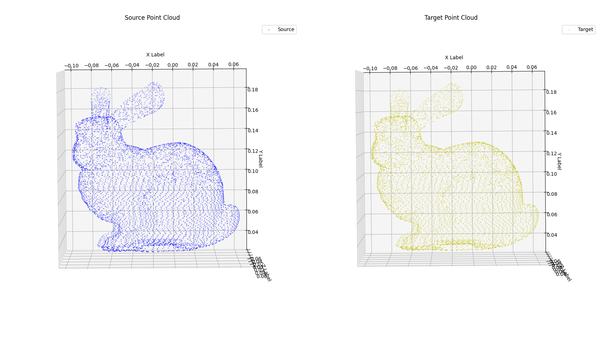

# Iterative Closest Point Algorithm (ICP)

This repository implements the Iterative Closest Point (ICP) algorithm. Below is the step-by-step procedure:

1. **Initial Transformation**: Start with an initial transformation matrix, which is the identity matrix in this case.
2. **Find Closest Points**: For each point in the source point cloud, identify the closest point in the target point cloud.
3. **Compute Transformation**: Using the closest points from both the source and target point clouds, compute the transformation (rotation and translation) that minimizes the error between the matched points. This transformation matrix is calculated using Singular Value Decomposition (SVD).
4. **Apply and Iterate**: Apply the computed transformation to the source point cloud and calculate the mean error. Repeat the process until the error falls below a defined threshold or the maximum number of iterations is reached.

---

## How to Run the Code

Follow the instructions below to set up your environment and run the code:

1. **Create a Conda or Virtual Environment**: 
   Run the following commands to create and activate the environment:

    ```bash
    conda create --name point_cloud
    conda activate point_cloud
    ```

2. **Install Required Libraries**:
   Install the necessary Python libraries by running the commands below:

    ```bash
    pip install open3d
    pip install numpy
    pip install matplotlib
    pip install plotly
    ```

3. **Execute the Code**:
   Navigate to the `icp` directory and run the `point_cloud_registration.py` script:

    ```bash
    cd icp
    python point_cloud_registration.py
    ```

---

## Results

Below is an example of the output generated using `matplotlib`:

<p align="center">

</p>