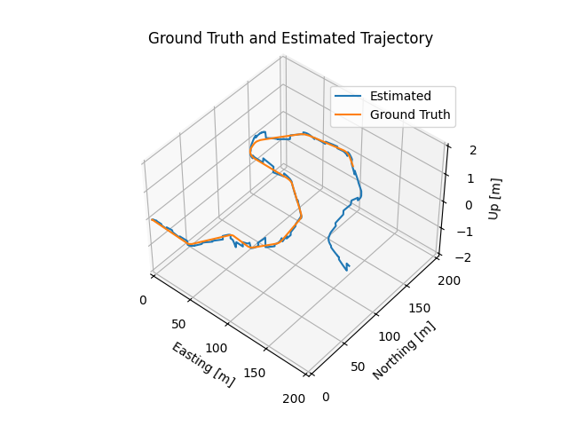
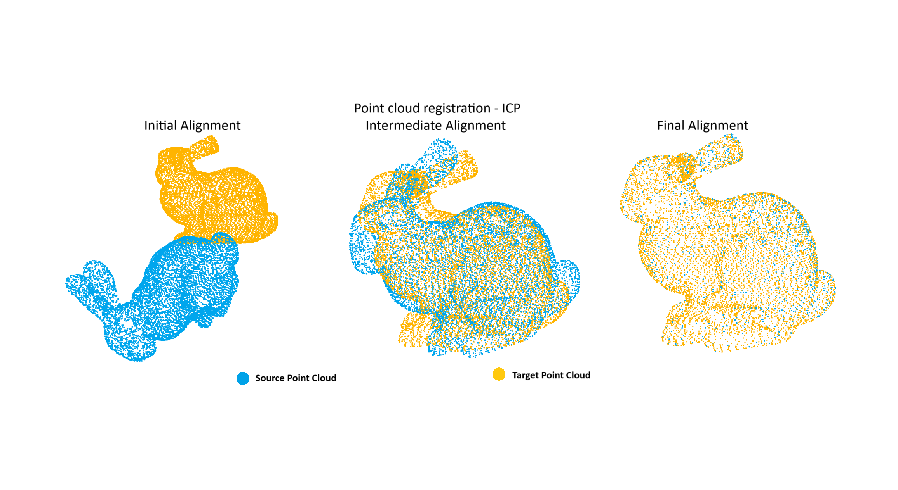

# Overview

This repository contains algorithms, insights, and implementations of various concepts in localization, such as SLAM, point clouds, and the Kalman Filter.

---

# State Estimation

**State estimation** in robotics or autonomous systems refers to determining the state of a robot (such as its position or velocity) at any given time. This involves integrating data from multiple sensors and models to estimate the robot's condition despite noise, uncertainties, or incomplete information.

In the `State_Estimation` folder, an **Extended Kalman Filter (EKF)** is implemented to localize a vehicle using LiDAR, IMU, and GNSS data obtained from the Carla Simulator. The **Kalman Filter** is a recursive algorithm that provides optimal state estimation for linear dynamic systems with Gaussian (normally distributed) process and measurement noise. The EKF is a generalization of the Kalman Filter for non-linear systems.

This is my implementation for the final project/assignment from the course [1]. The estimated trajectory of the vehicle after applying the filter is shown below. For instructions on running the code, refer to the [State Estimation README](State_Estimation/README.md).

---

# Point Cloud Registration

A **point cloud** is a set of data points in 3D space, typically representing the surface of an object or scene. Each point contains 3D coordinates (x, y, z), and may include additional attributes like color or intensity. **Point cloud registration** is the process of aligning multiple point clouds into a common coordinate system. This is essential when point clouds are captured from different perspectives or times and need to be merged into a single 3D model. The goal is to minimize the error between corresponding points in the overlapping areas.

The **Iterative Closest Point (ICP)** algorithm is one of the most widely used methods for point cloud registration. ICP iteratively refines the alignment of two point clouds by minimizing the distance between corresponding points. In this implementation, a point cloud is rotated, and the ICP algorithm is applied to align it with the original point cloud. The results of this alignment are shown below. For instructions on running the ICP algorithm, refer to the [Point Cloud Registration README](Point_Cloud_Registration/README.md).

---

## References

1. *State Estimation and Localization for Self-Driving Cars*, a Coursera course by the University of Toronto.
