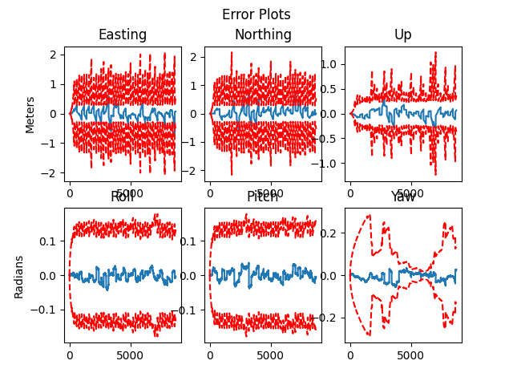

# Instructions to Run the Code:

1. Ensure that your current working directory, within any Python environment, is set to `Extended_Kalman_Filter`. Additionally, make sure the `data` folder (containing LiDAR, IMU, and GNSS data) is present within this directory.
   
2. Run the `es_ekf.py` file using a Python IDE or terminal. To run the script from the terminal, use the following command:
   
    ```bash
    python es_ekf.py
    ```

3. The results will be displayed on the screen.

---

## Error Plots

<p align="center">

</p>
